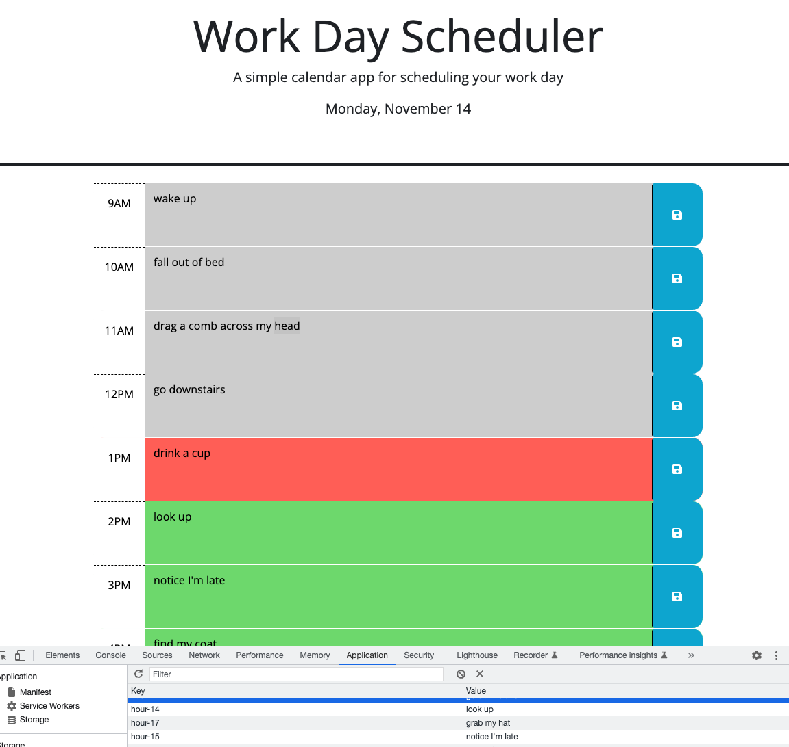

# Challenge Five - Weekday Scheduler

## Description
This week's assignment was to take an online weekday scheduler format, and make it interactive using JavaScript and Web APIs such as jQuery, Bootstrap, and Day.js.

It's a simple calendar application that goes by the hour, and uses a current hour variable to compare what hour it is presently so the color coding groups (past, present, and future), are assigned to the proper rows. Additionally, using local storage, your schedule will stay on the schedule, regardless if you close the window and reload/refresh or not.

The main takeaway I have from this project is don't make things more complex when they don't have to be. I initially tried to dynamically code my hour rows instead of putting them in the HTML (despite advice I had been given not do to do that). I was able to do that quickly and successfully, but adding in the other functions proved to be extremely difficult. After several hours of being on the same step, while my fellow classmates in the study group essentially completed their entire projects, I finally took my instructors' advice and changed my rows to be hard-coded in the HTML. After I did that, I did some rearraging of the code I had already written, and worked with my fellow classmates who had already finished, and I was done within 30 minutes.

It was very cool to get to use the Day.js web API. Learning about how these sites and applications get so much of the data they use was eye-opening to me about the possibilities of what can be made or done. It's especially cool how easy it is to access that data! This project was very good practice on learning how to use them and their different syntaxes. Reading the documentation on syntax is extremely important.

## Link
You can check out my application at https://carlihudson.github.io/workday-scheduler

## Usage
This application is used to keep an online hour-by-hour schedule of the users' workday.

## Credits
This week, I worked with my instructor, Jonathan Harvey, my tutor, Corrado Alfano, and a few AskBCS Learning Assistants. Additionally, I studied with fellow classmates Ken Gibson, Matt Tobin, Tua Tuivai, Nick Bonner, and Ameera Noormohamed.